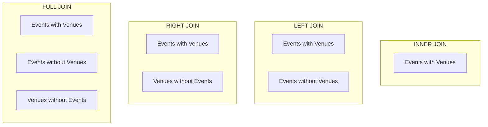

<div align="center">

# 🎭 Event Management System


<br>


<br><br>

*A robust, professional SQL database project demonstrating relational database design, constraints, CRUD operations, advanced joins, aggregate functions, nested subqueries, date/time manipulation, string formatting, window functions, and analytical reporting using PostgreSQL.*

</div>

---

### 🎥 Project Demonstration Video
Watch the detailed walkthrough of this project:
👉 **[Google Drive Video Link](https://drive.google.com/file/d/1VUW99bodHkyFNwlz5xLWgOqx5vfsHXAm/view?usp=sharing)**

---

## 📖 Project Overview

The **Event Management System** is a relational database designed to manage the booking, ticketing, payment, and scheduling of events. It supports tracking venue capacities, organizer details, events, attendee profiles, tickets, and payment statuses. 

The system maps out a comprehensive set of business processes involving:
* **Venues**: The physical locations where events are hosted, including capacities and geographic location.
* **Organizers**: The entities or companies planning and managing the events.
* **Events**: The scheduled occurrences including dates, seat availabilities, prices, associated venues, and organizers.
* **Attendees**: The profiles of users who register and book tickets for events.
* **Tickets**: Bookings that link an attendee to a specific event with status updates (`Confirmed`, `Cancelled`, `Pending`).
* **Payments**: The financial transactions backing the ticket bookings, showing success, pending, or failure statuses.

This project implements relational design principles, referential integrity rules, custom PostgreSQL enum types, and a wide array of querying techniques (from basic CRUD to advanced analytical window functions).

---

# 🎯 Objectives

* **Design a Relational Database**: Build a structured, normalized schema containing six tables.
* **Maintain Integrity**: Implement Primary Keys, Foreign Keys, Unique constraints, and Custom ENUM Types.
* **Perform CRUD Operations**: Insert new events, search patterns, update records, and delete rows safely.
* **Apply JOIN Types**: Demonstrate Inner Joins, Left Joins, Right Joins, and Full Outer Joins.
* **Utilize Aggregations**: Compute summary analytics including totals, averages, counts, and groups.
* **Leverage Subqueries**: Write nested scalar and set-membership queries.
* **Manipulate Dates & Timestamps**: Calculate intervals, extract months, and format timestamps.
* **Cleanse Strings**: Use casing, trimming, and null-coalescing operations.
* **Apply Window Functions**: Implement running totals, ranking, and cumulative sales statistics.
* **Execute Conditional Logic**: Classify data dynamically using `CASE` statements.

---

# ✨ Project Highlights

* ✔ **PostgreSQL Relational Schema**: Modeled six normalized tables with relationships.
* ✔ **Custom Enumerations**: Defined `ticket_status_type` and `payment_status_type` ENUMs for safety.
* ✔ **Composite Unique Constraint**: Enforced `UNIQUE (event_id, attendee_id)` on Tickets to prevent double booking.
* ✔ **Complex SQL Joins**: Leveraged INNER, LEFT, RIGHT, and FULL OUTER joins to combine tables.
* ✔ **Analytical Subqueries**: Solved reporting problems like identifying multi-booking attendees and active organizers.
* ✔ **Date Mathematics**: Computed event countdown timers and monthly summaries.
* ✔ **Window Functions**: Computed ranking indices, cumulative metrics, and running totals.
* ✔ **Dynamic Classification**: Categorized event seat demand and payment statuses on the fly.

---

# 🛠 Technologies Used

| Technology          | Purpose                    |
| ------------------- | -------------------------- |
| **PostgreSQL**      | Relational Database Management System (RDBMS) |
| **SQL**             | Query Language for Database Manipulation & Retrieval |
| **pgAdmin / DBeaver**| Database Client and Development Tool |
| **Relational Model**| Structured Data Storage & Schema Design |

---

# 📂 Project Structure

```text
Event_Management_System/
│
├── finalexam.sql              # PostgreSQL Database Creation & Query Script
├── README.md                  # Project Documentation (This File)
│
└── tables images/             # Folder containing database screenshots
    ├── Screenshot 2026-08-08 211715.png  # Venues & Organizers Table Output
    ├── Screenshot 2026-08-08 211816.png  # Events Table Output
    ├── Screenshot 2026-08-08 211832.png  # Attendees Table Output
    ├── Screenshot 2026-08-08 211913.png  # Tickets Table Output
    └── Screenshot 2026-08-08 211925.png  # Payments Table Output
```

---

# 🗃 Database Information

| Property         | Value                               |
| ---------------- | ----------------------------------- |
| **Database Name**| `Event_Management_System`           |
| **RDBMS**        | PostgreSQL                          |
| **SQL Dialect**  | PostgreSQL SQL                     |
| **Total Tables** | 6                                   |
| **Custom Types** | 2 (`ticket_status_type`, `payment_status_type`) |

---

# 🗄 Database Tables & Schema

Below are the schema details for each of the six tables in the system.

## 🏛 1. Venues
Stores the location and seating capacity of the physical hosting venues.
* **Primary Key**: `venue_id`

| Column | Data Type | Constraints | Description |
| --- | --- | --- | --- |
| `venue_id` | `INT` | `PRIMARY KEY` | Unique identifier for each venue |
| `venue_name` | `VARCHAR(100)` | `NOT NULL` | The name of the venue |
| `location` | `VARCHAR(100)` | `NOT NULL` | The city where the venue is located |
| `capacity` | `INT` | `NOT NULL` | Seating capacity of the venue |

---

## 👨‍💼 2. Organizers
Stores company or coordinator information responsible for organizing events.
* **Primary Key**: `organizer_id`

| Column | Data Type | Constraints | Description |
| --- | --- | --- | --- |
| `organizer_id` | `INT` | `PRIMARY KEY` | Unique identifier for each organizer |
| `organizer_name` | `VARCHAR(100)` | `NOT NULL` | The name of the organizer |
| `contact_email` | `VARCHAR(100)` | - | Email address of the organizer |
| `phone_number` | `VARCHAR(15)` | - | Contact phone number |

---

## 🎭 3. Events
Stores the scheduled occurrences, referencing their respective venues and organizers.
* **Primary Key**: `event_id`
* **Foreign Keys**: 
  * `venue_id` references `Venues(venue_id)`
  * `organizer_id` references `Organizers(organizer_id)`

| Column | Data Type | Constraints | Description |
| --- | --- | --- | --- |
| `event_id` | `INT` | `PRIMARY KEY` | Unique identifier for each event |
| `event_name` | `VARCHAR(100)` | `NOT NULL` | The name of the event |
| `event_date` | `TIMESTAMP` | - | Date and time when the event takes place |
| `venue_id` | `INT` | `FOREIGN KEY` | Referencing venue hosting the event |
| `organizer_id` | `INT` | `FOREIGN KEY` | Referencing organizer managing the event |
| `ticket_price` | `DECIMAL(10,2)` | `NOT NULL` | Price of a single ticket |
| `total_seats` | `INT` | `NOT NULL` | Total seats available initially |
| `available_seats`| `INT` | `NOT NULL` | Currently empty seats |

---

## 👥 4. Attendees
Stores personal contact profiles of participants booking tickets.
* **Primary Key**: `attendee_id`

| Column | Data Type | Constraints | Description |
| --- | --- | --- | --- |
| `attendee_id` | `INT` | `PRIMARY KEY` | Unique identifier for each attendee |
| `name` | `VARCHAR(100)` | `NOT NULL` | Full name of the attendee |
| `email` | `VARCHAR(100)` | - | Email address |
| `phone_number` | `VARCHAR(15)` | - | Contact phone number |

---

## 🎟 5. Tickets
Tracks event bookings. Enforces a rule that an attendee can only book one ticket per event.
* **Primary Key**: `ticket_id`
* **Foreign Keys**:
  * `event_id` references `Events(event_id)`
  * `attendee_id` references `Attendees(attendee_id)`
* **Unique Key**: `UNIQUE (event_id, attendee_id)` (Composite key)
* **Custom Type**: `status` field uses custom ENUM `ticket_status_type` (`Confirmed`, `Cancelled`, `Pending`)

| Column | Data Type | Constraints | Description |
| --- | --- | --- | --- |
| `ticket_id` | `INT` | `PRIMARY KEY` | Unique identifier for the ticket |
| `event_id` | `INT` | `FOREIGN KEY` | The event booked |
| `attendee_id` | `INT` | `FOREIGN KEY` | The attendee booking the event |
| `booking_date` | `TIMESTAMP` | `NOT NULL` | Date and time the ticket was booked |
| `status` | `ticket_status_type` | `NOT NULL` | Ticket status (`Confirmed`, `Cancelled`, `Pending`) |

---

## 💳 6. Payments
Tracks the financial transactions associated with ticket purchases.
* **Primary Key**: `payment_id`
* **Foreign Key**: `ticket_id` references `Tickets(ticket_id)`
* **Custom Type**: `payment_status` uses custom ENUM `payment_status_type` (`Success`, `Failed`, `Pending`)

| Column | Data Type | Constraints | Description |
| --- | --- | --- | --- |
| `payment_id` | `INT` | `PRIMARY KEY` | Unique identifier for the payment |
| `ticket_id` | `INT` | `FOREIGN KEY` | Referencing ticket corresponding to payment |
| `amount_paid` | `DECIMAL(10,2)` | `NOT NULL` | Amount of money paid |
| `payment_status`| `payment_status_type` | `NOT NULL` | Status of transaction (`Success`, `Failed`, `Pending`) |
| `payment_date` | `TIMESTAMPTZ` | - | Timestamp of transaction with timezone |

---

# 📊 SQL Concepts & Functions Covered

* **Database Constraints**: `PRIMARY KEY`, `FOREIGN KEY`, `UNIQUE`, `NOT NULL`.
* **Custom Domain Datatypes**: PostgreSQL Custom ENUM definitions.
* **Data Manipulation (CRUD)**: `INSERT INTO`, `SELECT`, `UPDATE SET`, `DELETE FROM`.
* **Query Clauses**: `WHERE`, `LIKE`, `IN`, `ORDER BY`, `GROUP BY`, `HAVING`, `LIMIT`.
* **JOINS**: `INNER JOIN`, `LEFT JOIN`, `RIGHT JOIN`, `FULL OUTER JOIN`.
* **Aggregate Functions**: `SUM()`, `COUNT()`, `AVG()`, `MAX()`.
* **Subqueries**: Scalar subqueries, Multi-row subqueries (`IN`), Grouping/Filtering subqueries.
* **Date & Time Operations**: `extract(month from ...)`, PostgreSQL Type Cast (`::date`), `NOW()`, `INTERVAL`, `to_char()`.
* **String Operations**: `upper()`, `trim()`, `coalesce()`.
* **Window Functions**: `RANK() OVER()`, `COUNT() OVER()`, `SUM() OVER()`.
* **Conditional Logic**: `CASE WHEN ... THEN ... ELSE END`.

---

# 📖 Detailed Query Explanations

Here is a step-by-step breakdown of every SQL query in [finalexam.sql](file:///d:/RD/weekly%20task/Final%20Exam/finalexam.sql), explaining how they work and what business questions they solve.

## 1. CRUD Operations on Events (1.1 - 1.4)

### 🔹 1.1 Insert a New Event
```sql
insert into Events
(event_id, event_name, event_date, venue_id, organizer_id,
 ticket_price, total_seats, available_seats)
values
(11, 'Ahmedabad Business Expo', '2026-12-20 10:00:00',
 1, 1, 1800.00, 1000, 1000);
```
* **Explanation**: Adds a brand-new row to the `Events` table representing the "Ahmedabad Business Expo" event. It links the event to Venue `1` and Organizer `1`, setting the price to `1,800.00` and initializing the seating availability.

### 🔹 1.2 Query Events using String Matching
```sql
select * from Events where event_name like '%Ahmedabad%';
```
* **Explanation**: Demonstrates simple search functionality. The `%` wildcards around `'Ahmedabad'` mean that it will return any event where the name contains the word "Ahmedabad" anywhere (start, middle, or end).

### 🔹 1.3 Update Event Records
```sql
update Events set ticket_price = 2000.00 where event_id = 11;
```
* **Explanation**: Demonstrates data modification. The price of the newly added event (`event_id = 11`) is adjusted from `1800.00` to `2000.00`.

### 🔹 1.4 Delete Event Records
```sql
delete from Events where event_id = 11;
```
* **Explanation**: Removes the event record with ID `11` from the table, completing the CRUD lifecycle (Create, Read, Update, Delete).

---

## 2. Advanced Joins & DateTime Filters (2.1 - 2.3)

### 🔹 2.1 Find Future Events in Ahmedabad
```sql
select e.event_id,e.event_name,e.event_date,v.venue_name,v.location 
from events e 
inner join venues v on e.venue_id = v.venue_id 
where v.location = 'Ahmedabad' and e.event_date > now();
```
* **Explanation**: Displays upcoming events located in Ahmedabad. It performs an `INNER JOIN` between `Events` and `Venues` to get the venue location, then uses `e.event_date > now()` to ensure we only retrieve events scheduled in the future relative to the database server's current timestamp.

### 🔹 2.2 Top 5 Revenue-Generating Confirmed Events
```sql
select e.event_name,e.ticket_price,count(t.ticket_id) as tick_sold,sum(e.ticket_price) as total_revenue 
from events e
inner join tickets t on e.event_id = t.event_id
where t.status = 'Confirmed'
group by e.event_id,e.event_name,e.ticket_price
order by total_revenue desc
limit 5;
```
* **Explanation**: Finds which events have generated the most sales. It joins `Events` and `Tickets` tables on `event_id`, filters bookings where the status is `'Confirmed'`, and groups by event name and price. It computes the total count of tickets sold and the sum of revenues, orders the results in descending order of revenue, and limits the output to the top 5 records.

### 🔹 2.3 Recent Registrations (Last 7 Days)
```sql
select a.name,t.ticket_id,t.booking_date 
from attendees a
inner join tickets t on a.attendee_id = t.attendee_id
where t.booking_date >= NOW() - INTERVAL '7 day'
order by t.booking_date desc;
```
* **Explanation**: Finds who booked tickets within the last week. It joins `Attendees` and `Tickets` and filters bookings using datetime arithmetic (`NOW() - INTERVAL '7 day'`), sorting the newest registrations first.

---

## 3. Data Extraction & Outer Joins (3.1 - 3.3)

### 🔹 3.1 December Events with High Vacancy (>50% seats left)
```sql
select e.event_id,e.event_name,e.event_date,e.total_seats,e.available_seats 
from events e
where extract(month from e.event_date) = 12 
  and e.available_seats > (e.total_seats * 0.50);
```
* **Explanation**: Targets under-booked events scheduled in December. The `extract(month from event_date)` function isolates the month component of the timestamp. It then checks if the currently available seats exceed 50% (`0.50`) of the total capacity.

### 🔹 3.2 Attendees with Tickets or Pending Payments
```sql
select distinct a.attendee_id, a.name 
from attendees a
left join tickets t on a.attendee_id = t.attendee_id
left join payments p on t.ticket_id = p.ticket_id
where t.ticket_id is not null or p.payment_status = 'Pending';
```
* **Explanation**: Fetches unique attendees who have booked a ticket OR have an outstanding pending transaction. It links `Attendees` via `LEFT JOIN` to `Tickets` and `Payments`, ensuring attendees with no successful transactions are still checked if their status is pending.

### 🔹 3.3 Find Non-Sold-Out Events
```sql
select event_id,event_name,total_seats,available_seats
from events where not available_seats = 0;
```
* **Explanation**: Demonstrates the `NOT` logic operator to retrieve events that still have at least 1 seat left (`available_seats != 0`).

---

## 4. Sorting & Revenue Aggregations (4.1 - 4.3)

### 🔹 4.1 Sort Events Chronologically
```sql
select event_name,event_date,ticket_price
from events order by event_date asc;
```
* **Explanation**: Lists all events starting with the earliest date (ascending order).

### 🔹 4.2 Group Attendees Count per Event
```sql
select e.event_id,e.event_name,count(t.attendee_id) as total_attendees 
from events e
left join tickets t on e.event_id = t.event_id
group by e.event_id,e.event_name 
order by total_attendees desc;
```
* **Explanation**: Calculates the booking volume per event. A `LEFT JOIN` is used to include events that have zero ticket bookings. It groups by event details, counts the bookings, and lists the most popular events at the top.

### 🔹 4.3 Revenue per Event from Successful Payments
```sql
select e.event_id,e.event_name,sum(p.amount_paid) as total_revenue 
from events e
left join tickets t on e.event_id = t.event_id
left join payments p on t.ticket_id = p.ticket_id and p.payment_status = 'Success'
group by e.event_id,e.event_name
order by total_revenue;
```
* **Explanation**: Tallies the total financial earnings received per event. It joins `Events` to `Tickets` and then `Payments`. Critically, it joins `Payments` using `and p.payment_status = 'Success'` as a join condition to sum only completed purchases, grouping the sum per event.

---

## 5. Summary Statistics (5.1 - 5.3)

### 🔹 5.1 System-Wide Successful Revenue
```sql
select sum(amount_paid) as total_revenue 
from payments where payment_status = 'Success';
```
* **Explanation**: Computes the total sum of money collected system-wide from successfully completed transactions.

### 🔹 5.2 Attendance Volume Ascending
```sql
select e.event_id,e.event_name, count(t.attendee_id) as total_attendance 
from events e
left join tickets t on e.event_id = t.event_id
group by e.event_id, e.event_name 
order by total_attendance;
```
* **Explanation**: Similar to 4.2, but sorted in ascending order to highlight low-performing events that might require promotional pushes.

### 🔹 5.3 Average Ticket Price
```sql
select avg(ticket_price) as avg_ticket_pri from events;
```
* **Explanation**: Calculates the average base price of tickets across all event registrations.

---

## 7. Joins Comparison (7.1 - 7.4)

These queries illustrate how different `JOIN` types behave using the `Events` and `Venues` relationship.



### 🔹 7.1 Inner Join
```sql
select e.event_name,e.event_date,v.venue_name,v.location
from events e inner join venues v on e.venue_id = v.venue_id;
```
* **Explanation**: Returns only matching rows. If an event has no venue or a venue hosts no events, they are excluded from the output.

### 🔹 7.2 Left Outer Join
```sql
select e.event_name,e.event_date,v.venue_name,v.location
from events e left join venues v on e.venue_id = v.venue_id;
```
* **Explanation**: Returns all events, even if they have no venue assigned. Unassigned venue values will be shown as `NULL`.

### 🔹 7.3 Right Outer Join
```sql
select e.event_name,e.event_date,v.venue_name,v.location
from events e right join venues v on e.venue_id = v.venue_id;
```
* **Explanation**: Returns all venues, even if they have no events booked at them. Unbooked events fields are populated as `NULL`.

### 🔹 7.4 Full Outer Join
```sql
select e.event_name,e.event_date,v.venue_name,v.location
from events e full outer join venues v on e.venue_id = v.venue_id;
```
* **Explanation**: Returns all rows from both tables. It lists events without venues, venues without events, and matching events at venues.

---

## 8. Subqueries / Nested Queries (8.1 - 8.3)

### 🔹 8.1 Events Priced Above Average
```sql
select event_id,event_name,ticket_price from events
where ticket_price > (select avg(ticket_price) from events);
```
* **Explanation**: A scalar subquery determines the system-wide average ticket price first. The outer query then filters out events priced strictly higher than that average.

### 🔹 8.2 Attendees with Multi-Event Bookings
```sql
select attendee_id,name,email from attendees
where attendee_id in
(select attendee_id from tickets group by attendee_id having count(distinct event_id) > 1);
```
* **Explanation**: The inner query groups the `Tickets` table by `attendee_id` and filters for IDs that booked more than one unique event. The outer query selects contact information for those matching IDs.

### 🔹 8.3 Organizers with High Volume (>3 Events)
```sql
select organizer_id,organizer_name,contact_email from organizers
where organizer_id in 
(select organizer_id from events group by organizer_id having count(event_id) > 3);
```
* **Explanation**: Identifies active organizers. The inner query checks `Events`, group by `organizer_id` and keeps groups with more than 3 events. The outer query fetches their profile data.

---

## 9. Date Operations & Time Formatting (9.1 - 9.3)

### 🔹 9.1 Extract Month component
```sql
select event_id,event_name,event_date,extract(month from event_date) as event_month 
from events;
```
* **Explanation**: Isolates the integer month (1 to 12) from the `event_date` timestamp.

### 🔹 9.2 Event Countdown (Days Remaining)
```sql
select event_id,event_name,event_date,(event_date::date - current_date) as days_remaining
from events 
where event_date::date >= current_date
order by event_date;
```
* **Explanation**: Casts `event_date` to `date` using the `::date` operator, then subtracts the database's `current_date` to yield an integer representing the remaining days, filtering out past events.

### 🔹 9.3 Custom Timestamp Formatting
```sql
select payment_id,ticket_id,payment_status,
       to_char(payment_date, 'yyyy-mm-dd hh24:mi:ss') as formatted_payment_date 
from payments;
```
* **Explanation**: Formats a raw database timestamp into a standardized, readable string format (`YYYY-MM-DD HH24:MI:SS`) using the `to_char()` function.

---

## 10. String Trimming & Null Handling (10.1 - 10.3)

### 🔹 10.1 Casing Standardization
```sql
select organizer_id,upper(organizer_name) as organizer_name from organizers;
```
* **Explanation**: Capitalizes organizer names using the `upper()` string function.

### 🔹 10.2 Whitespace Trimming
```sql
select attendee_id,trim(name) as attendee_name from attendees;
```
* **Explanation**: Cleans names by removing leading/trailing spaces via the `trim()` function.

### 🔹 10.3 Null Coalescing
```sql
select attendee_id,name,coalesce(email, 'Not Provided') as email from attendees;
```
* **Explanation**: Displays `'Not Provided'` instead of blank `NULL` fields for attendees who did not submit an email address.

---

## 11. Analytical Window Functions (11.1 - 11.3)

Window functions calculate aggregate values over a specific partition of rows without collapsing them into a single row.

### 🔹 11.1 Revenue Ranking
```sql
select e.event_id,e.event_name,
       rank() over (order by coalesce(sum(case when p.payment_status = 'Success' then p.amount_paid else 0 end))) as revenue_rank
from events e
left join tickets t on e.event_id = t.event_id
left join payments p on t.ticket_id = p.ticket_id
group by e.event_id,e.event_name
order by revenue_rank;
```
* **Explanation**: Assigns a rank to events ordered by their successful earnings. If two events have identical revenues, they receive the same rank number. The `RANK() OVER (ORDER BY...)` syntax ensures ranks are calculated relative to the entire dataset ordered by sum.

### 🔹 11.2 Cumulative Ticket Bookings
```sql
select t.ticket_id,t.event_id,t.booking_date,t.status,
       count(*) over (order by t.booking_date) as cumulative_ticket_sales
from tickets t
order by t.booking_date;
```
* **Explanation**: Computes a running count of tickets booked. For each row, the window function `COUNT(*) OVER (ORDER BY booking_date)` sums the number of bookings made up to that specific record's date.

### 🔹 11.3 Running Total of Attendees
```sql
select event_id,event_name,total_attendees,
       sum(total_attendees) over (order by event_id) as running_total_attendees
from (
    select e.event_id,e.event_name,count(t.attendee_id) as total_attendees 
    from events e
    left join tickets t on e.event_id = t.event_id
    group by e.event_id,e.event_name
) as event_attendees
order by event_id;
```
* **Explanation**: Calculates the running cumulative attendance sum as we step through `event_id`. The inner subquery groups attendee counts by event, and the outer query uses `SUM(total_attendees) OVER (ORDER BY event_id)` to accumulate the sum chronologically/sequentially.

---

## 12. Conditional logic (12.1 - 12.2)

### 🔹 12.1 Dynamic Ticket Demand Categorization
```sql
select event_id,event_name,total_seats,available_seats,
       case
           when available_seats < (total_seats * 0.20) then 'high demand'
           when available_seats < (total_seats * 0.50) then 'moderate demand'
           else 'low demand'
       end as demand_category 
from events;
```
* **Explanation**: Dynamically labels ticket demand. If available seats drop below 20% of capacity, it returns `'high demand'`; if below 50% it returns `'moderate demand'`; otherwise `'low demand'`.

### 🔹 12.2 Clean Payment Status Names
```sql
select payment_id,ticket_id,amount_paid,payment_status,
       case
           when payment_status = 'Success' then 'successful'
           when payment_status = 'Failed' then 'failed'
           else 'pending'
       end as payment_category 
from payments;
```
* **Explanation**: Maps capitalized database statuses into clean, lowercase text descriptors for front-end rendering or customer receipts.

---

# 📸 Project Outputs

Below are the screenshots displaying the query outputs of each database table:

### 📊 1. Venues & Organizers Data
<p align="center">
  
</p>

### 🎭 2. Events Data
<p align="center">
  
</p>

### 👥 3. Attendees Data
<p align="center">
  
</p>

### 🎟 4. Tickets Data
<p align="center">
  
</p>

### 💳 5. Payments Data
<p align="center">
  
</p>

---

# 🎓 Learning Outcomes

By designing and executing this project, I consolidated expertise in:
* **Relational Normalization**: Aligning data into logical entity tables to minimize redundancy.
* **Integrity Constraints**: Preventing inconsistencies by setting foreign keys and custom enums.
* **Data Flow Modeling**: Linking ticket registrations directly to payment transactions.
* **Query Writing**: Translating analytical business questions into performant SQL queries.
* **Window Calculations**: Constructing partition models for running totals and rankings.
* **Date & String Parsing**: Standardizing date views and sanitizing user inputs.

---

# 💼 Skills Demonstrated

* **Database Design & Architecture** (PostgreSQL-specific types, keys, and schemas).
* **Advanced Querying Techniques** (Windowing, CTE-like logic, and Nested Subqueries).
* **Conditional Data Modeling** (CASE evaluations, NULL values handling).
* **Business Analytics & Reporting** (Calculating revenues, conversion rates, and ticket volumes).

---

# 🚀 How to Run

### Step 1: Install PostgreSQL
Ensure you have **PostgreSQL Server** and a database client like **pgAdmin** or **DBeaver** installed on your machine.

### Step 2: Create the Database
Open your SQL console or client and create a new database:
```sql
CREATE DATABASE Event_Management_System;
```

### Step 3: Run the Script
1. Open [finalexam.sql](file:///d:/RD/weekly%20task/Final%20Exam/finalexam.sql) in your editor.
2. Select the `Event_Management_System` database connection.
3. Run the entire script to create tables, custom types, populate records, and execute the queries.

### Step 4: Explore the Queries
Browse the bottom of the SQL script to run individual analytical queries and examine the database outputs.

---

# 📌 Project Summary

The **Event Management System** is a professional PostgreSQL relational database project that models the ticketing, payment, and scheduling operations of an event company. It acts as a comprehensive demonstrating portfolio, proving proficiency in data definition languages (DDL), manipulation queries (DML), and advanced analytical features (DQL) like subqueries, conditional logic, and window functions.

---

# 👨‍💻 Author

**Krish Patel**
*Database Designer & Developer*
